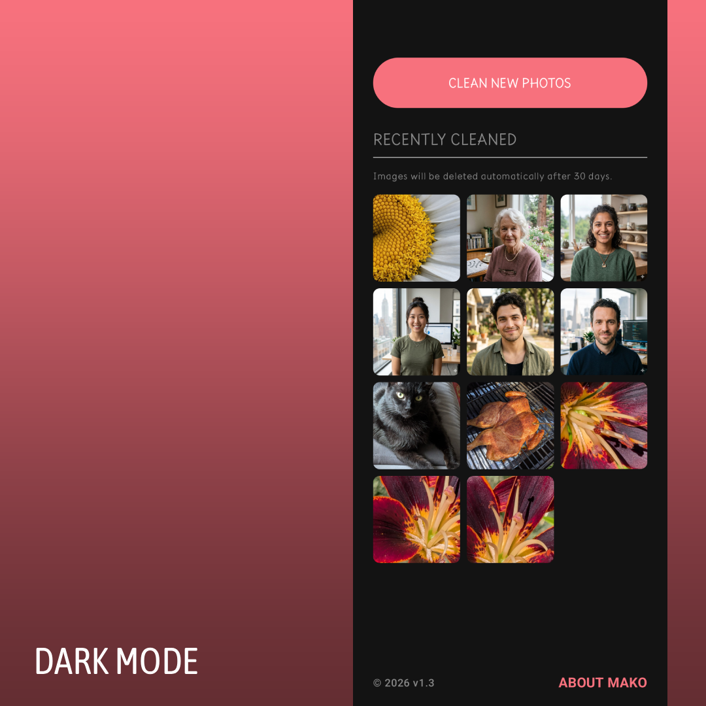
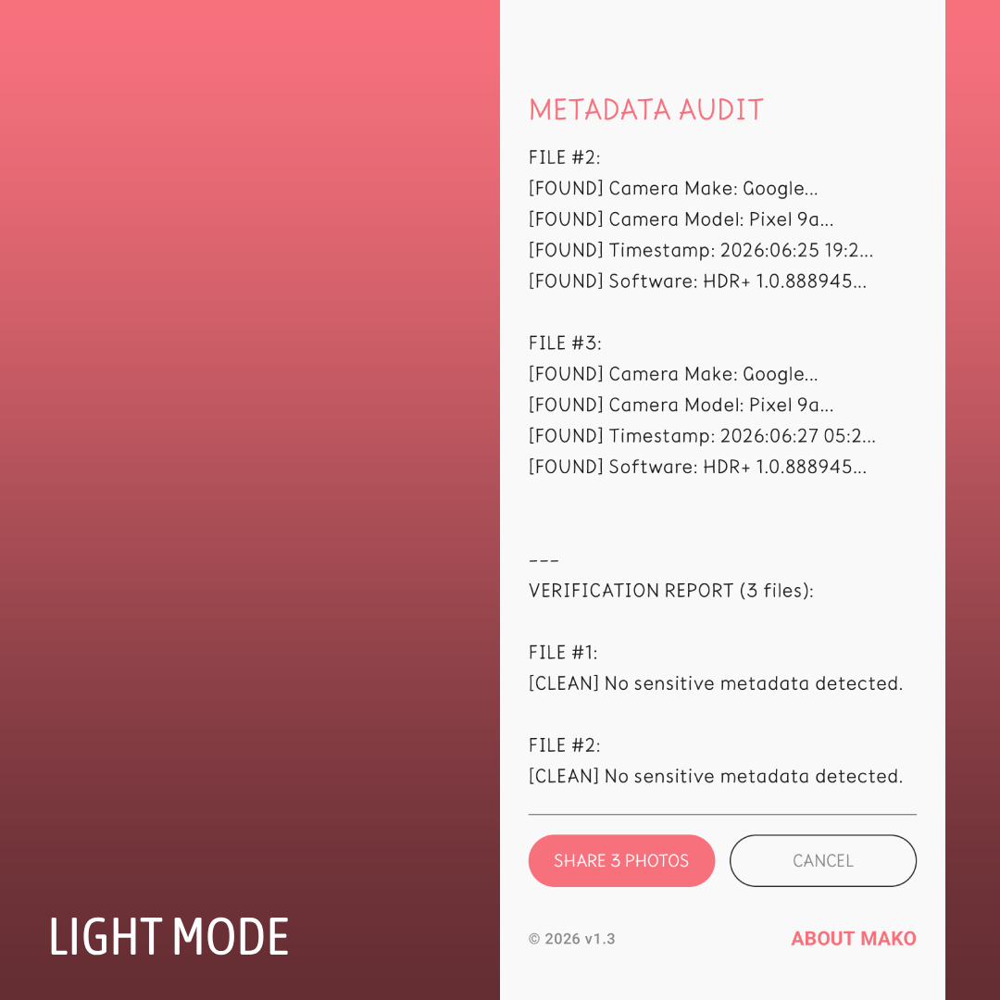
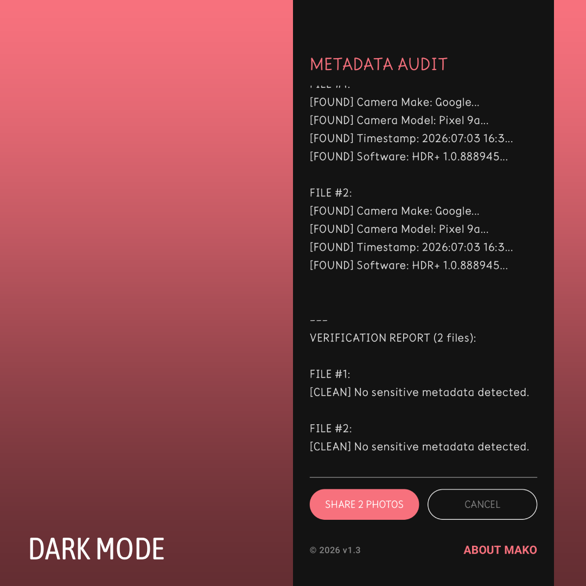

# Mako Scrubber

Removes EXIF metadata from photos before you share them. Local-only. Zero INTERNET permission. GPLv3.

## What it does

Mako Scrubber strips GPS location, camera make/model, timestamps, and other identifying EXIF metadata from photos before you post or send them. Share it from any app, get clean copies back — no account, no cloud, no upload, ever.

## Screenshots

<p>




</p>

## Features

- Strips GPS location, camera make/model, timestamp, and software tags from JPEG/HEIC photos
- Works from any app's share sheet (`Share > Mako Scrubber`)
- Batch scrub and share/delete multiple photos at once
- Cleaned photos auto-expire after 30 days
- No internet permission — the app cannot phone home even if it wanted to
- No accounts, no subscriptions, no ads

## Install

- **Play Store:** *(link once published)*
- **IzzyOnDroid:** *(link once accepted)*
- **F-Droid:** *(link once accepted)*
- **Obtainium:** point it at this GitHub repo's Releases to track updates directly

## Verify our claims

- The `AndroidManifest.xml` in this repo requests no `INTERNET` permission — check for yourself in [app/src/main/AndroidManifest.xml](app/src/main/AndroidManifest.xml).
- [Exodus Privacy report](https://reports.exodus-privacy.eu.org/) — *(add link once scanned)*
- Full source is here. Build it yourself and compare against the signed release APK.

## Part of The Mako Way

Mako Scrubber is one app in [The Mako Way](https://www.makoway.app) suite — local-only tools with no accounts and no subscriptions, ever.

## Building

Standard Android Gradle project, no proprietary tooling required:

```
./gradlew assembleRelease
```

Requires JDK 17+ and the Android SDK (`compileSdk 36`, `minSdk 24`).

## License

GPLv3 — see [LICENSE](LICENSE). Anyone shipping a modified version must publish their source.
